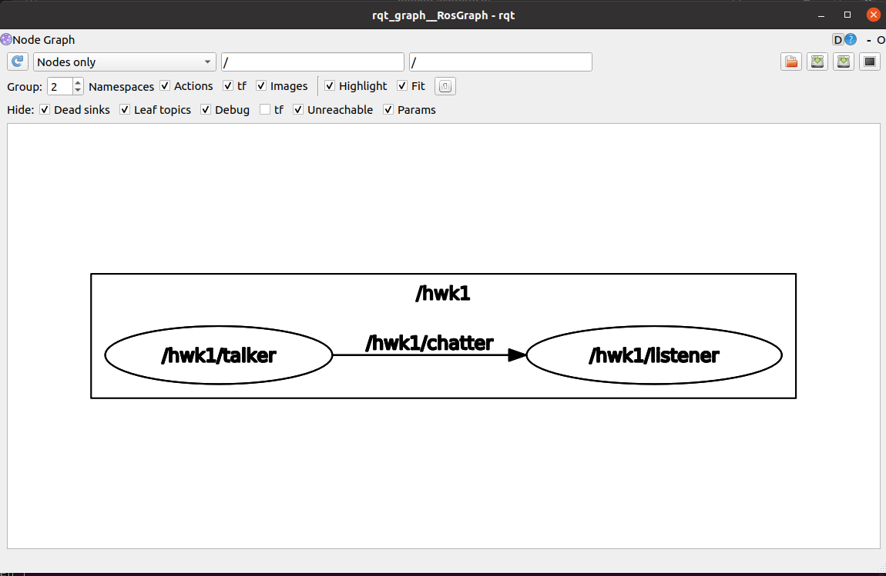

# ROS机器人操作系统基础与实战作业

### 作业1：自定义msg的Topic发送和接收

作业1的源代码存放在use_topic软件包中，具体内容是创建了两个节点talker.py和listener.py，talker.py发布chatter话题并持续在话题中发送消息，listener.py节点订阅该节点接收消息并打印在终端上。

我自定义了一个Myinfo.msg的msg文件存放在软件包中的msg文件夹中，其中内容如下

```
string my_name
int32 age
```

为了自定消息可以生成和发送，需要修改CMakelist.txt文件：

添加message_generation依赖项

```cmake
find_package(catkin REQUIRED COMPONENTS
  roscpp
  rospy
  std_msgs
  message_generation # 添加message_generation依赖项
)
```

添加在编译时生成'msg' 文件夹里的消息的代码和生成生成附加的消息

```cmake
在编译时生成'msg' 文件夹里的消息
add_message_files(
  FILES
  MyInfo.msg
)
# 生成附加的消息，并在此处列出所有依赖项。
generate_messages(
  DEPENDENCIES
  std_msgs
)
```

修改package.xml文件，添加message_generation编译和运行时的依赖

```xml
<build_depend>message_generation</build_depend> 
<exec_depend>message_runtime</exec_depend>
```

具体的talker.py节点和listener.py节点的的实现请参看代码文件

运行hw1.launch文件实现效果如下：


在rqt_graph中的节点图：



### 作业2：自定义srv的service服务和调用

作业2的的源代码存放在use_serv软件包中，具体内容是创建了add_two_ints_client.py, add_two_ints_server.py节点，add_two_ints_server.py提供一个`add_two_ints`的服务，作用是接受客户端传过来的两个整型，求它们的和并返回。add_two_ints_client.py节点接受命令行两个命令行参数，将他们解释为整型通过`add_two_ints`传输给add_two_ints_server.py节点并获取返回的值打印在终端上。

我定义了一个AddTwoInts.srv的srv文件存放在软件包中的srv文件夹中，其中内容如下

```
int64 a
int64 b
---
int64 sum
```

---前为请求内容，---后为返回内容

为了自定服务可以生成和发送，需要修改CMakelist.txt文件：

添加message_generation依赖项， 添加在编译时生成'srv' 文件夹里的消息的代码和生成生成附加的服务

```
find_package(catkin REQUIRED COMPONENTS
  roscpp
  rospy
  std_msgs
  message_generation
)

# Generate services in the 'srv' folder
add_service_files(
  FILES
  AddTwoInts.srv
)

# Generate added messages and services with any dependencies listed here
generate_messages(
  DEPENDENCIES
  std_msgs
)
```

也需要修改package.xml文件，添加message_generation编译和运行时的依赖

```
<build_depend>message_generation</build_depend> 
<exec_depend>message_runtime</exec_depend>
```

具体服务端和客户端的具体实现请看代码

先运行add_two_ints_server.py节点，再添加命令行参数(为要想相加的两个数)运行add_two_ints_client.py实现效果如下：


### 作业3：使用手柄控制仿真小乌龟运动

作业3的的源代码存放在joy_turtle软件包中，具体内容是创建了use_joy_ctr_turtle.py节点，其作用是订阅joy_node节点向/joy话题发送的手柄数据，使用手柄数据向/turtle1/cmd_vel话题发送Twist消息来控制小乌龟运动。

joy_node节点的作用是读取连接在系统中的手柄（一般为/dev/input/js0）的数据并通过/joy话题发送，turtlesim_node监听/turtle1/cmd_vel话题，向此话题发送Twist消息可以控制小乌龟移动

use_joy_ctr_turtle.py节点实现请看代码

运行hw3.launch文件实现效果如下：


### 作业4：使用service切换改变小乌龟的轨迹的颜色和粗细

作业4的的源代码存放在change_pen_turtle软件包中，具体内容是创建了set_turtle_client.py节点，其作用是接受命令行的r g b width四个参数通过调用/turtle1/set_pen服务发送轨迹的参数信息（具体可以查看srv文件夹下的SetPen.srv,  turtlesim_node节点收到服务的要求部分后将改变小乌龟的运行轨迹

/turtle1/set_pen服务是turtlesim_node节点提供的服务可以更改小乌龟运行轨迹

set_turtle_client.py节点实现请看代码

运行hw4.launch文件和set_turtle_client.py实现效果如下

先运行hw4.launch文件


使用R = 240 G = 10 B= 10 width = 10 命令行参数set_turtle_client.py改变轨迹的颜色和线宽


### 作业5：绘制一个三自由度带夹爪的机械臂的URDF, 并实现在rviz中的控制，以及在gazebo的仿真

标准化机器人描述格式 （URDF ）是一种用于描述机器人、其部分结构、关节、自由度等的XML 格式文件。通过使用机器人的URDF 文件，在ROS 中仿真机器人或者是帮助机器人开发者简化他们的日常工作。

机械臂参考图如下


我绘制的机械臂的URDF 文件保存在my_urdf软件包的urdf目录下，在定义了基本的link和joint前提下，为了能实现在rviz中的控制，以及在gazebo的仿真，我又为其添加了color， collision，transmission，inertial等参数，并添加了gazebo插件。

#### 5.1在rviz中的控制机械臂

运行hw5.launch文件效果如下


#### 5.2在Gazebo进行机械臂仿真

运行hw5.5.launch文件效果如下


运行下列命令可以控制Gazebo仿真环境下的机械臂

```
// 控制夹爪开启
rostopic pub  /r2d2_gripper_controller/command std_msgs/Float64MultiArray "layout:
  dim:
  - label: ''
    size: 3
    stride: 1
  data_offset: 0
data: [0, 0.5, 0.5]"
```


```
// 控制夹爪关闭
rostopic pub  /r2d2_gripper_controller/command std_msgs/Float64MultiArray "layout:
  dim:
  - label: ''
    size: 3
    stride: 1
  data_offset: 0
data: [0, 0, 0]"
```


```
// 控制关节运动
rostopic pub /r2d2_link1_controller/command std_msgs/Float64 "data: -0.707"
rostopic pub /r2d2_link2_controller/command std_msgs/Float64 "data: 0.5"
```

### 作业6：实现URDF绘制的机械臂的moveit规划

作业6的实现思路是使用MoveIt配置助手生成MoveIt配置文件，然后运行MoveIt配置文件launch目录下的demo.launch文件

使用MoveIt配置助手生成MoveIt配置文件的细节可以参照这篇优秀且细致的文章[MoveIt入门之——使用MoveIt配置助手生成MoveIt配置文件_moveit使用](https://blog.csdn.net/weixin_41995979/article/details/81515711)

我的机械臂的MoveIt配置文件存放在my_moveit软件包中，运行demo.launch文件效果如下

规划关节规划组


规划夹爪规划组


### 大作业1：使用虚拟TurtleBot机器人

大作业1的的源代码存放在use_turtlebot3软件包中

以下小作业据需要运行TurtleBot机器人Gazebo仿真环境

```
export TURTLEBOT3_MODEL=waffle
roslaunch turtlebot3_gazebo turtlebot3_world.launch
```

#### 大作业1.1：手柄控制机器人移动

主要的实现思路是在启动joy_node节点接收游戏手柄数据并向/joy话题发送的手柄数据和运行turtlebot3_world.launch文件启动turtlebot3虚拟仿真环境，运行use_joy_ctr_turtlebot3.py节点订阅/joy话题话题接收手柄数据并发送控制Twist消息到cmd_vel话题控制机器人底盘运动。

设置环境变量export TURTLEBOT3_MODEL=waffle， 运行joy_bot.launch效果如下


#### 大作业1.2：手柄控制机器人完成环境建图

主要的实现思路是在大作业1.1：手柄控制机器人移动的基础上，运行gmapping 的 SLAM 节点和rviz（用于可视化）。注意为了确保能正确收到map数据，需要确保机器人的TF树完整，典型的TF frames结构如下


如果TF树不完整，需要手动发布TF变换，如何手动发布静态TF变换可以参照软件包内代码

运行my_mapping.launch效果如下


运行rosrun map_server map_saver -f <保存路径 >命令保存地图


在指定的目录下会生成两个地图文件


#### 大作业1.3：实现机器人导航

主要的实现思路是使用map server节点发布大作业1.2中保存的地图数据到ROS中，然后使用acml软件包实现机器人的自主定位和使用move base软件包实现机器人的实时路径规划和导航

基本的原理图如下


运行my_mapping.launch文件

给机器人一个大致的初始地位


实现机器人的实时路径规划和导航


move base算法可以实现实时路径规划和导航，如果遇到地图中没有的障碍物会重新规划路线并导航


#### 大作业1.4：利用虚拟机器人实现简易的碰撞式扫地机器人功能

主要实现思路是读取激光雷达数据，当机器人靠近障碍物时减速并转向

激光雷达数据可以通过订阅/scan话题接收，控制机器人地盘移动可以通过向/cmd_vel话题发送Twist消息实现

运行clean_robot.py节点，实现效果如下：


### 大作业2：机械臂抓取水果

作业细节要求如下：


大作业2的源代码存放在catch_ fruits软件包中：

- usb_cam_gripper.launch文件用来连接相机和使用arduno控制的夹爪舵机
- robot_start.launch文件用来连接机械臂
- find_fruits.launch文件用来读取网格位置, 检测水果的位置(在哪个格子里)并通过fruits_position话题发送
- catch.launch文件用来订阅fruits_position话题获取水果的位置并抓取放到指定位置
- tag.py节点用来标定网格的位置并存储

实现效果视频可以参看：[抓个橘子：基于ROS和OpenCV的JAKA机械臂抓取任务设计](https://www.bilibili.com/video/BV1WZrUYXExB/?vd_source=bf08880c4c4d8fdcca4d17ed2ee821fe)