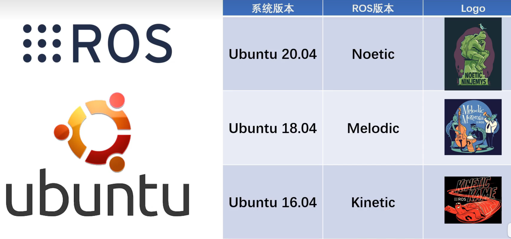

# ROS简介

## 什么是ROS？

类似于安卓系统，**ROS(Robot Operating System)** 将机器人程序拆散成不同的可以独立运行的模块（即节点），这种分布式的理念，大大提高了机器人程序的可移植性。

ROS并不是真实的操作系统，它一般运行在Linux等其他电脑操作系统上，更像是一套机器人软件框架

## 为什么要学习ROS?

通过下载使用前人写好的软件包，避免重复造轮子，ROS让构建机器人程序更加容易快速，同时通过遵循统一规范的接口标准，我们自己写的轮子也可以给别人使用，如发布到ROS官网和GitHub上

## 如何学习ROS？

第一步：选择合适的Ubuntu版本和安装对应的ROS版本

第二步：选择合适的实验对象，多实践

可以选择实体的智能小车和仿真平台