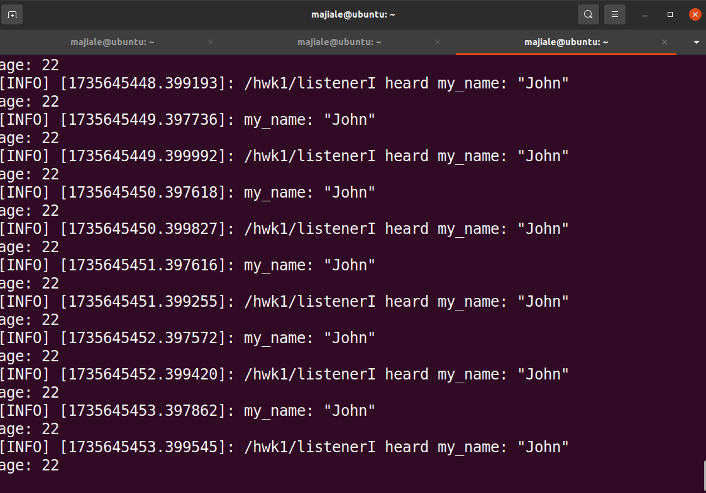
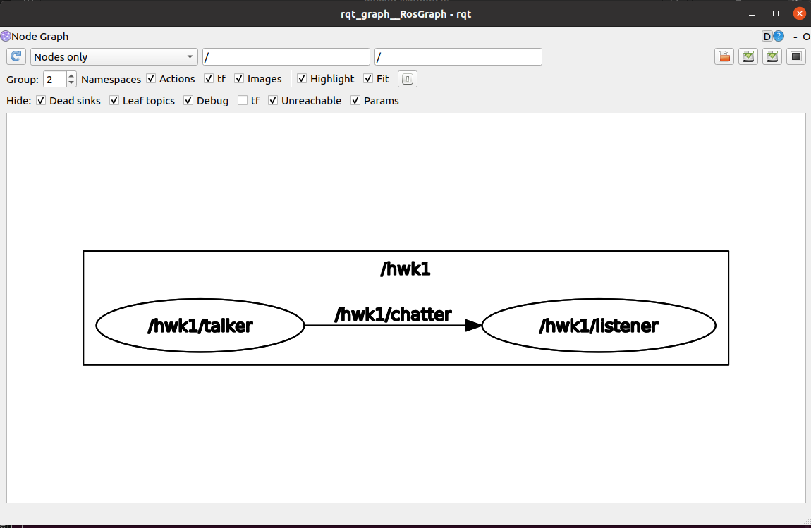
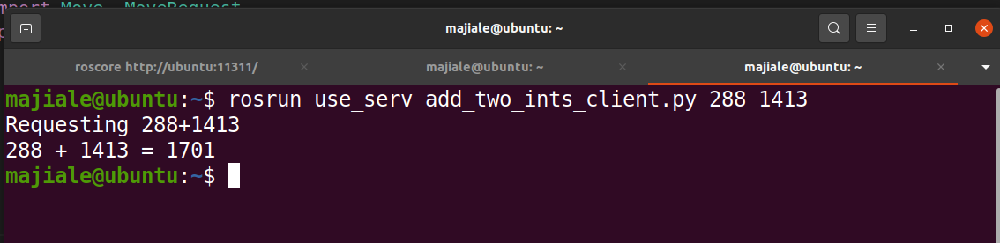

# ROS机器人操作系统基础与实战作业

### 作业1：自定义msg的Topic发送和接收

作业1的源代码存放在use_topic软件包中，具体内容是创建了两个节点talker.py和listener.py，talker.py发布chatter话题并持续在话题中发送消息，listener.py节点订阅该节点接收消息并打印在终端上。

我自定义了一个Myinfo.msg的msg文件存放在软件包中的msg文件夹中，其中内容如下

```
string my_name
int32 age
```

为了自定消息可以生成和发送，需要修改CMakelist.txt文件：

添加message_generation依赖项

```cmake
find_package(catkin REQUIRED COMPONENTS
  roscpp
  rospy
  std_msgs
  message_generation # 添加message_generation依赖项
)
```

添加在编译时生成'msg' 文件夹里的消息的代码和生成生成附加的消息

```cmake
在编译时生成'msg' 文件夹里的消息
add_message_files(
  FILES
  MyInfo.msg
)
# 生成附加的消息，并在此处列出所有依赖项。
generate_messages(
  DEPENDENCIES
  std_msgs
)
```

修改package.xml文件，添加message_generation编译和运行时的依赖

```xml
<build_depend>message_generation</build_depend> 
<exec_depend>message_runtime</exec_depend>
```

具体的talker.py节点和listener.py节点的的实现请参看代码文件

运行hw1.launch文件实现效果如下：



在rqt_graph中的节点图：



### 作业2：自定义srv的service服务和调用

作业2的的源代码存放在use_serv软件包中，具体内容是创建了add_two_ints_client.py, add_two_ints_server.py节点，add_two_ints_server.py提供一个`add_two_ints`的服务，作用是接受客户端传过来的两个整型，求它们的和并返回。add_two_ints_client.py节点接受命令行两个命令行参数，将他们解释为整型通过`add_two_ints`传输给add_two_ints_server.py节点并获取返回的值打印在终端上。

我定义了一个AddTwoInts.srv的srv文件存放在软件包中的srv文件夹中，其中内容如下

```
int64 a
int64 b
---
int64 sum
```

---前为请求内容，---后为返回内容

为了自定服务可以生成和发送，需要修改CMakelist.txt文件：

添加message_generation依赖项， 添加在编译时生成'srv' 文件夹里的消息的代码和生成生成附加的服务

```
find_package(catkin REQUIRED COMPONENTS
  roscpp
  rospy
  std_msgs
  message_generation
)

# Generate services in the 'srv' folder
add_service_files(
  FILES
  AddTwoInts.srv
)

# Generate added messages and services with any dependencies listed here
generate_messages(
  DEPENDENCIES
  std_msgs
)
```

也需要修改package.xml文件，添加message_generation编译和运行时的依赖

```
<build_depend>message_generation</build_depend> 
<exec_depend>message_runtime</exec_depend>
```

具体服务端和客户端的具体实现请看代码

先运行add_two_ints_server.py节点，再添加命令行参数(为要想相加的两个数)运行add_two_ints_client.py实现效果如下：




### 作业3：使用手柄控制仿真小乌龟运动

作业3的的源代码存放在joy_turtle软件包中，具体内容是创建了use_joy_ctr_turtle.py节点，其作用是订阅joy_node节点向/joy话题发送的手柄数据，使用手柄数据向/turtle1/cmd_vel话题发送Twist消息来控制小乌龟运动。

joy_node节点的作用是读取连接在系统中的手柄（一般为/dev/input/js0）的数据并通过/joy话题发送，turtlesim_node监听/turtle1/cmd_vel话题，向此话题发送Twist消息可以控制小乌龟移动

use_joy_ctr_turtle.py节点实现请看代码

运行hw3.launch文件实现效果如下：

gif

### 作业4：使用service切换改变小乌龟的轨迹的颜色和粗细

作业4的的源代码存放在change_pen_turtle软件包中，具体内容是创建了set_turtle_client.py节点，其作用是接受命令行的r g b width四个参数通过调用/turtle1/set_pen服务发送轨迹的参数信息（具体可以查看srv文件夹下的SetPen.srv,  turtlesim_node节点收到服务的要求部分后将改变小乌龟的运行轨迹

/turtle1/set_pen服务是turtlesim_node节点提供的服务可以更改小乌龟运行轨迹

set_turtle_client.py节点实现请看代码

运行hw4.launch文件实现效果如下

gif

