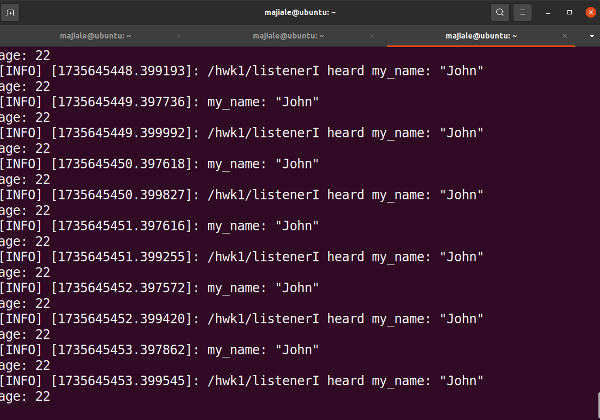

# ROS机械人操作系统基础与实战作业

### 作业1：自定义msg的Topic发送和接收

作业一的源代码存放在use_topic软件包中，具体内容是创建了两个节点talker.py和listener.py，talker.py发布chatter话题并持续在话题中发送消息，listener.py节点订阅该节点接收消息并打印在终端上。

我自定义了一个Myinfo.msg的msg文件存放在软件包中的msg文件夹中，其中内容如下

```
string my_name
int32 age
```

为了自定消息可以生成和发送，需要修改CMakelist.txt文件：

添加message_generation依赖项

```
find_package(catkin REQUIRED COMPONENTS
  roscpp
  rospy
  std_msgs
  message_generation # 添加message_generation依赖项
)
```

添加在编译时生成'msg' 文件夹里的消息的代码和生成生成附加的消息

```
在编译时生成'msg' 文件夹里的消息
add_message_files(
  FILES
  MyInfo.msg
)
# 生成附加的消息，并在此处列出所有依赖项。
generate_messages(
  DEPENDENCIES
  std_msgs
)
```

修改package.xml文件，添加message_generation编译和运行时的依赖

```
<build_depend>message_generation</build_depend> 
<exec_depend>message_runtime</exec_depend>
```

具体的talker.py节点和listener.py节点的的实现请参看代码文件

运行hw1.launch文件实现效果如下：



在rqt_graph中的节点图：


### 作业2：自定义srv的service服务和调用

作业的的源代码存放在use_serv软件包中，具体内容是创建了add_two_ints_client.py, add_two_ints_server.py节点，add_two_ints_server.py提供一个`add_two_ints`的服务，作用是接受客户端传过来的两个整型，求它们的和并返回。add_two_ints_client.py节点接受命令行两个命令行参数，将他们解释为整型通过`add_two_ints`传输给add_two_ints_server.py节点并获取返回的值打印在终端上。

我定义了一个AddTwoInts.srv的srv文件存放在软件包中的srv文件夹中，其中内容如下

```
int64 a
int64 b
---
int64 sum
```

---前为请求内容，---后为返回内容

为了自定服务可以生成和发送，需要修改CMakelist.txt文件：

添加message_generation依赖项， 添加在编译时生成'srv' 文件夹里的消息的代码和生成生成附加的服务

```
find_package(catkin REQUIRED COMPONENTS
  roscpp
  rospy
  std_msgs
  message_generation
)

# Generate services in the 'srv' folder
add_service_files(
  FILES
  AddTwoInts.srv
)

# Generate added messages and services with any dependencies listed here
generate_messages(
  DEPENDENCIES
  std_msgs
)
```

也需要修改package.xml文件，添加message_generation编译和运行时的依赖

```
<build_depend>message_generation</build_depend> 
<exec_depend>message_runtime</exec_depend>
```

具体服务端和客户端的具体实现请看代码